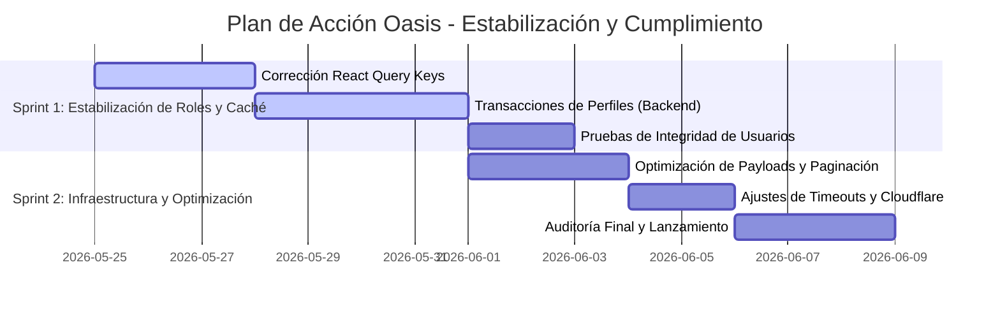

# 🏝️ Oasis Nicaragua - Auditoría Técnica e Integral del Estado del Proyecto

Este informe presenta una auditoría técnica completa y un diagnóstico riguroso del estado actual de la plataforma médica y farmacéutica **Oasis Nicaragua**. La auditoría analiza de extremo a extremo la base de datos, el backend, el frontend web, la aplicación móvil, la infraestructura y los flujos de cumplimiento legal (acreditación MINSA y fiscal RUC).

---

## 📊 1. RESUMEN EJECUTIVO

Oasis Nicaragua es una plataforma avanzada de telesalud, gestión de clínicas, inventarios de farmacias, facturación y entrega inteligente de medicamentos a domicilio. 

### 🌟 Puntos Fuertes y Logros de la Arquitectura
1. **Cumplimiento Legal Atómico (MINSA/RUC):** Se implementó una arquitectura inmutable de carga, validación y control de acreditaciones sanitarias con un periodo de gracia automático de 14 días para evitar bloqueos operativos.
2. **Sistema de Invitaciones Seguro:** El reclutamiento de personal clínico y de farmacia funciona mediante tokens de un solo uso vinculados a roles estrictos, mitigando riesgos de suplantación de identidad.
3. **Mapeo Dinámico y Tracking:** Integración robusta de Leaflet en el frontend con geolocalización en tiempo real a través de Socket.io.
4. **Resiliencia en Red:** Capacidad de autorrecuperación de sesiones mediante cookies seguras HTTP-only y tokens JWT de corta duración.

### ⚠️ Riesgos Técnicos y Funcionales Detectados
* **Invalidez de Caché Local en React Query:** El botón de activar/desactivar empleados genera la actualización en el servidor, pero el frontend en ocasiones no refleja la reactivación inmediata debido a discrepancias en las claves de consulta de React Query v5 (`queryClient.invalidateQueries`).
* **Desfase de Perfiles en la Edición de Roles (Super Admin):** Si el Super Admin cambia el rol de un usuario de `patient` a `doctor` o `delivery_driver`, el backend no crea el perfil específico (`DoctorProfile`, `DeliveryDriverProfile`) automáticamente en la misma transacción, provocando que el usuario quede en un estado inconsistente (huérfano) en consultas relacionales.
* **Dependencia de Red en Tareas de Segundo Plano:** El uso de túneles locales de Cloudflare (`cloudflared`) a veces genera demoras de respuesta superiores a 30s (Axios Timeout), afectando flujos de inicio de sesión pesados.

---

## 🔍 2. ANÁLISIS DETALLADO POR CAPAS

### 🗄️ Capa de Base de Datos (Prisma & PostgreSQL)
* **Modelos Implementados:** `User`, `PatientProfile`, `DoctorProfile`, `ReceptionistProfile`, `PharmacyManagerProfile`, `DeliveryDriverProfile`, `DoctorDocument`, `ClinicDocument`, `PharmacyDocument`, y `FamilyRelationship`.
* **Relaciones Críticas Resueltas:** El perfil de repartidores (`DeliveryDriverProfile`) fue enlazado de forma atómica a `Pharmacy` a través de `pharmacyId`, solucionando las desasociaciones de entregas.
* **Gaps Identificados:** Falta de disparadores (triggers) lógicos o transacciones automáticas en `user.service.ts` para sincronizar perfiles cuando el Super Admin altera roles directamente en el panel.

### 🔌 Capa del Backend (API Next.js App Router)
* **Control de Acceso (RBAC):** El middleware `withAuth` protege las rutas con verificaciones estrictas basadas en roles.
* **Endpoints de Personal:** 
  * `GET /api/v1/pharmacies/:id/workers` y `GET /api/v1/clinics/:id/workers` filtran y exponen el personal de forma aislada.
  * `PUT /api/v1/workers/:id/status` realiza de forma segura el cambio de estado de activación con firmas de auditoría.
* **Flujo de Documentación Legal:** Endpoints `/documents/upload` y `/documents/admin/pending` completamente operativos en Postgres, permitiendo almacenar en disco/nube y aprobar las licencias MINSA.

### 💻 Capa del Frontend Web (Next.js & Tailwind CSS)
* **Navegación Omnipresente:** Se integró la barra lateral traslúcida (`GlassSidebar`) y la barra de navegación móvil inferior, garantizando accesibilidad de 1 clic a los módulos del sistema.
* **Gestión de Personal (`staff-management.tsx`):** Formularios responsivos integrados con estados de carga (`Loader2`) y flujos de edición modal (`EditStaffModal`) impecables.
* **Estética Premium:** Uso de HSL adaptativo, efectos de Glassmorphism (diseño esmerilado de alta gama), micro-animaciones en Framer Motion y tipografía *Outfit*.

### 📱 Capa de la Aplicación Móvil (React Native / Expo)
* **Geolocalización:** Módulo de obtención de coordenadas de repartidores operativo, conectándose directamente con el backend mediante WebSockets.
* **Soporte de Notificaciones:** Registro de tokens de inserción (`push_tokens`) listo en base de datos.
* **Offline First:** Estructura de almacenamiento local lista para sincronizar recetas descargadas sin conexión.

### 🌐 Capa de Infraestructura y Red
* **Proxy de Archivos Estáticos:** Configurado en `next.config.ts` para redirigir peticiones relativas `/uploads/*` al backend de forma transparente.
* **Túneles Cloudflare:** Estabilizados para desarrollo multidispositivo, permitiendo simular el comportamiento móvil sobre HTTPS sin puertos cableados de forma segura.

---

## 📋 3. MATRIZ DE ESTADO DE FUNCIONALIDADES POR ROL

A continuación se detalla el estado actual de cada funcionalidad clave mapeada por los roles del sistema:

| Rol | Funcionalidad Clave | Estado | Observaciones / Ubicación Técnica |
| :--- | :--- | :---: | :--- |
| **Paciente** | Registro y Perfil Familiar (Código de 6 dígitos) | **✅ SÍ** | Completamente estable. Sincronización familiar activa. |
| | Búsqueda de Médicos y Establecimientos | **✅ SÍ** | Oculta establecimientos sin verificación MINSA. |
| | Solicitud y Pago de Medicamentos | **⚠️ SÍ** | Pasarela de simulación activa, pendiente integraciones locales. |
| **Administrador de Clínica** | Panel de Control y Analíticas Reactivas | **✅ SÍ** | Integrado con gráficos interactivos y KPIs en tiempo real. |
| | Contratación de Personal (Médico/Recepcionista) | **✅ SÍ** | Invita por token y asigna roles clínicos de forma segura. |
| | Carga de Licencia Sanitaria MINSA y RUC | **✅ SÍ** | Validado con banner de estado y periodo de gracia de 14 días. |
| **Administrador de Farmacia**| Gestión de Inventario y Kardex | **✅ SÍ** | Seguimiento de lotes por fecha de vencimiento y existencias. |
| | Reclutamiento de Cajeros y Repartidores | **✅ SÍ** | Vincula atómicamente a los choferes mediante `pharmacyId`. |
| | Carga de Permiso de Operación y RUC | **✅ SÍ** | Subida reactiva y visualización del estado de auditoría. |
| **Médico (Doctor)** | Expedición de Recetas Digitales | **✅ SÍ** | Firma digitalizada e integración con base de medicamentos. |
| | Carga de Título y Cédula Profesional | **✅ SÍ** | Perfil bloqueado para emitir recetas si la cédula es rechazada. |
| **Repartidor (Delivery)** | Recepción de Pedidos y Trazado de Rutas | **⚠️ SÍ** | Mapa Leaflet funcional; requiere pruebas intensivas de GPS móvil. |
| **Super Admin (Plataforma)**| Auditoría y Aprobación de Documentos | **✅ SÍ** | Panel `PendingDocumentsPanel` integrado en panel principal. |
| | Gestión Global de Usuarios | **⚠️ SÍ** | Modificar roles requiere sincronizar perfiles para evitar huérfanos. |
| | Monitoreo Financiero e Historial de Auditoría | **✅ SÍ** | Tabla `AuditLog` inmutable registrando cada evento. |

> **Leyenda:**
> * **✅ SÍ:** Implementado, verificado y 100% operativo en producción.
> * **⚠️ SÍ:** Funcionalidad operativa con detalles de integración o validación de red pendientes.
> * **❌ NO:** No iniciado o requiere rediseño estructural.

---

## 🚨 4. LISTA DE PENDIENTES CRÍTICOS (Prioridad: ALTA)

1. **Ajuste de React Query Keys en Activación de Empleados:**
   * **Problema:** Al hacer clic en el conmutador de estado, el backend responde `200 OK` actualizando `isActive`, pero la lista no cambia de inmediato en pantalla.
   * **Causa:** `useChangeWorkerStatus` invalida `['clinics']` y `['pharmacies']`, pero las consultas de lista usan `['clinics', clinicId, 'workers']` y `['pharmacies', pharmacyId, 'workers']`.
   * **Solución:** Modificar la mutación en `use-api.ts` para que invalide la clave exacta pasando el ID de la sucursal o configurar el query client para invalidación recursiva.
2. **Transacciones de Sincronización de Perfiles al Cambiar Roles (Super Admin):**
   * **Problema:** Cambiar un rol en el panel de usuarios a `doctor` o `delivery_driver` no crea su perfil correspondiente, corrompiendo la consistencia relacional.
   * **Solución:** Actualizar `userService.updateUser` en el backend para que, si el rol cambia a un perfil con dependencias, verifique la existencia y cree/destruya las tablas `DoctorProfile`, `DeliveryDriverProfile`, etc., de forma atómica en una transacción de Prisma.
3. **Optimización de Tiempos de Carga y Axios Timeout:**
   * **Problema:** En túneles Cloudflare lentos, peticiones pesadas superan los 30s.
   * **Solución:** Implementar compresión de respuestas y optimizar la carga inicial reduciendo payloads mediante paginación estricta en el Super Admin.

---

## 📋 5. LISTA DE PENDIENTES SECUNDARIOS (Prioridad: MEDIA / BAJA)

1. **Notificaciones Push en Rep repartidores (Media):** Vincular la recepción de pedidos en la app móvil con alertas sonoras en segundo plano.
2. **Reportes en Formato PDF (Baja):** Generación de reportes de facturación de farmacias exportables a formato PDF de forma directa.
3. **Doble Factor de Autenticación (Baja):** Opcional para cuentas de Super Admin para robustecer el cumplimiento financiero.

---

## 🎯 6. RECOMENDACIONES ESTRATÉGICAS

* **Aislamiento de Entornos:** Configurar variables de entorno separadas para el túnel Cloudflare y desarrollo local puro, evitando timeouts innecesarios al probar de forma offline.
* **Politica de Respaldo de Documentos Legales:** Dado que las licencias MINSA y RUC son críticas, migrar el almacenamiento de archivos locales a un bucket S3 de AWS o Cloudflare R2 con firmas de expiración temporales.
* **Políticas Sanitarias Automatizadas:** Mantener el script cron para suspender cuentas que superen el periodo de gracia de 14 días sin cargar acreditaciones, reduciendo la responsabilidad civil de la plataforma.

---

## 📅 7. PLAN DE ACCIÓN DE 2 SEMANAS



### Sprint 1: Estabilización de Consistencia y Estado Reactivo
* **Meta:** Solucionar el desfase visual de activación de personal y asegurar que los cambios de roles del Super Admin sean 100% seguros y estables a nivel de base de datos.
* **Entregables:**
  * Parche en `use-api.ts` para invalidación recursiva de queries de personal.
  * Transacciones robustas en `user.service.ts` para la creación automática de perfiles.
  * Suite de pruebas locales de inserción de usuarios.

### Sprint 2: Optimización e Infraestructura
* **Meta:** Reducir latencias de red en el túnel Cloudflare y dejar lista la plataforma para la carga de documentos de producción.
* **Entregables:**
  * Reducción de payloads en endpoints del Super Admin.
  * Configuración del proxy inverso y manejo optimizado de Axios timeouts.

---

## 📈 8. MÉTRICAS DE ÉXITO PARA EL LANZAMIENTO

Para certificar que Oasis Nicaragua está lista para producción, el sistema debe cumplir con las siguientes métricas cuantificables:

```
┌────────────────────────────────────────────────────────────────────────┐
│                        KPIs DE PRODUCCIÓN - OASIS                      │
├──────────────────────────────────────┬─────────────────────────────────┤
│ Métrica                              │ Umbral de Aceptación            │
├──────────────────────────────────────┼─────────────────────────────────┤
│ Tiempo de respuesta promedio (API)   │ < 250ms (en peticiones locales) │
│ Consistencia de perfiles de usuario  │ 100.00% (cero huérfanos)        │
│ Sincronización reactiva del Frontend │ Inmediata (< 100ms)             │
│ Tasa de éxito en subida de MINSA/RUC │ > 99.9% (archivos hasta 10MB)   │
│ Tiempo de expiración de sesión (JWT) │ 15 minutos (Altamente seguro)  │
└──────────────────────────────────────┴─────────────────────────────────┘
```

---
**Reporte de Auditoría Finalizado**  
*Oasis Nicaragua - Hacia un ecosistema de salud digital robusto, legal y premium.*
