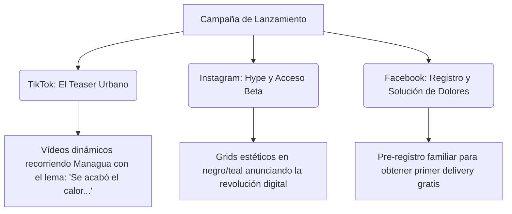

# 🪐 Oasis Líquida: Estrategia Visual y Plantillas (Enfoque Pre-Lanzamiento / App Nueva)

Este documento define la estrategia visual y de contenidos de redes sociales orientada al **inminente lanzamiento** de la nueva aplicación Oasis Líquida en Managua, Nicaragua. Toda la comunicación está diseñada para generar expectativa (*hype*), captar registros para la lista de espera y reclutar a los primeros médicos, farmacias y pacientes beta.

---

## 1. Paleta de Colores de Expectativa (Lanzamiento)

Para el prelanzamiento de una aplicación nueva, el contraste y la claridad de la llamada a la acción (CTA) son vitales. Usamos estos colores para guiar el ojo hacia el botón de "Pre-Registro" o "Lista de Espera".

| Color | Código Hex | Rol en Lanzamiento | Psicología de Campaña |
| :--- | :--- | :--- | :--- |
| **Teal Oasis** | `#14b8a6` | Bordes luminosos y botones de Pre-Registro. | La frescura del agua que llega a calmar la salud. |
| **Emerald Orgánico**| `#10b981` | Insignias de "Próximamente" y "MINSA Certificado". | Credibilidad, salud segura y lista de espera abierta. |
| **Rose Alerta** | `#f43f5e` | Elementos de urgencia / Cuenta regresiva. | Impacto inmediato, el corazón de la app. |
| **Indigo Clínico** | `#4f46e5` | Textos científicos y gráficos de telemetría. | Respaldado por tecnología real de vanguardia. |
| **Dark Crystal** | `#09090b` | Fondo oscuro obsidiana de todas las piezas. | El misterio de lo nuevo, premium, moderno y digital. |
| **Glow Blanco** | `#ffffff` | Textos principales "Coming Soon" y fechas de salida. | Luminosidad, limpieza y contraste. |

---

## 2. Estrategia de Contenido de Expectativa por Canal (Managua)

La narrativa de precampaña para la capital se enfoca en resolver el dolor del caos vial y de salud antes de que la aplicación esté disponible públicamente.

### A. TikTok: El "Teaser" en las Calles de Managua
* **Mensaje Clave:** *"Se acabó recorrer Managua bajo el sol de farmacia en farmacia. Algo nuevo está llegando."*
* **Visuales:** Tomas rápidas de motocicletas de delivery vacías en puntos icónicos de Managua (Rotonda Rubén Darío, Carretera Masaya) que de repente revelan la mochila isotérmica de Oasis Líquida brillando con luces Teal.
* **Llamado a la Acción (CTA):** *"Sé de los primeros 500 en Managua en probar la app. Regístrate en el link del perfil."*

### B. Instagram: Hype Estético y Acceso Exclusivo
* **Mensaje Clave:** *"El arte de recetar y comprar medicinas, ahora 100% fluido. Próximamente."*
* **Visuales:** Diseño editorial premium en modo oscuro. Imágenes del expediente médico virtual flotando como un holograma en 3D.
* **Llamado a la Acción (CTA):** *"Únete a la red de médicos fundadores en Nicaragua. Lista de espera abierta."*

### C. Facebook: Solución a Dolores e Invitación Familiar
* **Mensaje Clave:** *"Olvídate de las recetas en papel que se pierden y las filas interminables. La nueva forma de cuidar a tu familia está a punto de nacer."*
* **Visuales:** Comparativas de "Antes (Caos de papel, llamadas, calor)" vs "Después (Oasis Líquida: Receta digital, delivery bioseguro, SOS)".
* **Llamado a la Acción (CTA):** Enlace directo a WhatsApp o Landing Page para pre-registrarse y obtener el primer envío gratis en el lanzamiento oficial.

---

## 3. Diseños de Plantillas de Lanzamiento (Estructura y Composición)

Estas plantillas están diseñadas para comunicar que la aplicación es **nueva, moderna y está lista para salir al mercado**.

### Plantilla 1: Post de Expectación "¿Qué es Oasis Líquida?" (Instagram / Facebook - 1:1)
* **Propósito:** Presentar la nueva aplicación y sus 3 pilares antes del lanzamiento.
* **Paleta de Colores:** Fondo Dark Crystal (`#09090b`), acentos en Teal Oasis (`#14b8a6`) y Glow Blanco.
* **Estructura Visual:**
  * **Marco:** Línea fina satinada perimetral (`#ffffff14`) para simular una pantalla HUD.
  * **Esquina superior:** Insignia brillante: `PRÓXIMAMENTE • NICARAGUA`.
  * **Cuerpo:** 
    * Titular en **Outfit Bold**: *"La salud que fluye."*
    * Subtítulo en **Instrument Serif Itálica** (Teal `#14b8a6`): *"está por llegar."*
    * Lista de iconos translúcidos con los pilares:
      * 📱 Receta Digital Inviolable.
      * 🌡️ Delivery Bioseguro Controlado.
      * 🚨 Botón SOS de Emergencia.
  * **Pie:** Caja de registro: *"Regístrate gratis para el acceso anticipado."*

### Plantilla 2: Cuenta Regresiva de Lanzamiento (Instagram Stories - 9:16)
* **Propósito:** Mostrar los días que faltan para la salida oficial de la app en Managua.
* **Paleta de Colores:** Fondo degradado de Indigo Clínico (`#4f46e5`) a Dark Crystal (`#09090b`).
* **Estructura Visual:**
  * **Centro:** Números gigantes en tipografía monoespaciada blanca (ej. `03 DÍAS`) con sombra difusa en Teal Oasis (`#14b8a6`).
  * **Texto Superior:** *"Preparando el delivery bioseguro..."* en **Geist Regular**.
  * **Texto Inferior:** *"La revolución de la salud digital en Managua está a la vuelta de la esquina. Activa el recordatorio."*
  * **Elemento interactivo:** Widget de cuenta atrás nativo de Instagram Stories enmarcado visualmente por la plantilla.

### Plantilla 3: Invitación a Médicos Fundadores (Instagram / LinkedIn)
* **Propósito:** Atraer a los primeros profesionales de la salud para probar el panel de recetas electrónicas antes del lanzamiento público.
* **Paleta de Colores:** Fondo oscuro "Dark Crystal" (`#09090b`) con un aura de color Emerald Orgánico (`#10b981`).
* **Estructura Visual:**
  * **Gráfico Central:** Silueta de un estetoscopio estilizado 3D en vidrio translúcido con luces internas.
  * **Titular:** *"Digitalice su consultorio antes que nadie."* (Outfit Bold)
  * **Cuerpo:** *"Únase a la red de médicos fundadores de Oasis Líquida Nicaragua y prescriba sin papel desde el día uno."* (Geist Regular)
  * **Boton/CTA Claymorphic:** En el centro inferior: `SOLICITAR DEMO PRE-LANZAMIENTO` (Claymorphic Teal con sombras internas pronunciadas).

### Plantilla 4: Post de Expectativa de Delivery Bioseguro (Feed - 4:5)
* **Propósito:** Destacar que no somos otra app de reparto común antes de salir al mercado.
* **Paleta de Colores:** Fondo oscuro, overlays en Emerald Orgánico (`#10b981`) para transmitir bioseguridad militar.
* **Estructura Visual:**
  * **Fondo:** Foto en blanco y negro difusa del tráfico de Managua en Carretera a Masaya.
  * **Frente (Panel Glassmorphic):** Tarjeta central translúcida flotando.
  * **Contenido de la Tarjeta:**
    * Ícono de termómetro digital parpadeando en verde.
    * Título: *"Nuestra mochila de reparto no lleva comida. Lleva tranquilidad a temperatura exacta."* (Outfit Bold)
    * Detalle en **Instrument Serif**: *"Certificación de bioseguridad en camino."*
  * **Pie de Post:** Píldora de registro: *"Únete a la lista de espera de Managua en oasisliquida.com"*

### Plantilla 5: Landing Page Pre-Registro (Web / Mobile HUD View)
* **Propósito:** Captar leads de pacientes y familias en la web temporal.
* **Paleta de Colores:** Gradiente Teal a Índigo de fondo. Elementos en blanco translúcido.
* **Estructura Visual:**
  * **Cabecera:** Mensaje corto: *"Tu primer envío será 100% gratis si te registras hoy."* (Fondo Rose Alerta `#f43f5e`).
  * **Centro:** Formulario con bordes curvos de 24px:
    * Campo de entrada: *"Ingresa tu correo o teléfono de WhatsApp"*.
    * Botón de acción: `ASEGURAR ACCESO ANTICIPADO` (Claymorphic Emerald `#10b981`).
  * **Pie:** *"Próximamente disponible en Play Store y App Store para Nicaragua."*
