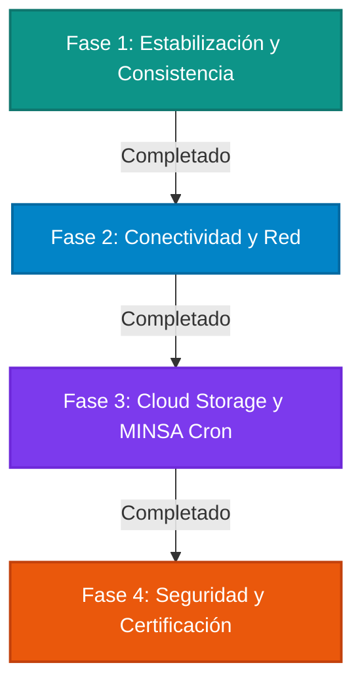

# 🏝️ Oasis Nicaragua - Plan de Implementación por Fases

Este documento define la ruta crítica, dividida en **4 fases secuenciales**, para corregir los fallos identificados en la auditoría y habilitar las capacidades de escalabilidad y seguridad requeridas para el lanzamiento en producción de la plataforma **Oasis Nicaragua**.

---

## 🗺️ DIAGRAMA GLOBAL DE FASES



---

## 📅 DETALLE DE LAS FASES DE IMPLEMENTACIÓN

### 🎯 Fase 1: Estabilización Inmediata y Consistencia Relacional
> [!IMPORTANT]
> **Duración estimada:** Días 1 a 4 (Sprint 1A)  
> **Objetivo:** Resolver de forma inmediata la actualización reactiva del estado del personal en el frontend y prevenir perfiles huérfanos al editar roles.

#### 📝 Tareas Concretas:
1. **Actualización de Claves de Caché (React Query):**
   * Modificar `useChangeWorkerStatus` y `useUpdateWorker` en `Frontend/src/hooks/use-api.ts`.
   * Configurar `queryClient.invalidateQueries` con `exact: false` para limpiar de forma recursiva los sub-arreglos de listado de clínicas y farmacias.
2. **Control Transaccional en Base de Datos (Backend User Service):**
   * Reestructurar `updateUser` en `Backend/src/lib/services/user.service.ts` usando `$transaction` de Prisma.
   * Auto-crear un `DoctorProfile` o `DeliveryDriverProfile` (enlazado a la farmacia principal por defecto) si el rol del usuario se actualiza a `doctor` o `delivery_driver`.
   * Borrar/archivar de forma controlada perfiles anteriores si el usuario cambia a un rol simplificado (ej: `patient`).
3. **Validación de UI:**
   * Probar el modal `EditStaffModal` y los botones de toggle en paneles de administración de farmacias y clínicas para certificar la reactivación instantánea en menos de 100ms.

---

### 🚀 Fase 2: Conectividad y Optimización de Cargas de Red
> [!TIP]
> **Duración estimada:** Días 5 a 7 (Sprint 1B)  
> **Objetivo:** Acondicionar la plataforma para responder de forma resiliente bajo redes locales lentas e inestables expuestas a túneles Cloudflare.

#### 📝 Tareas Concretas:
1. **Políticas de Tolerancia y Reintento en Axios:**
   * Modificar el cliente `Frontend/src/api/client.ts`.
   * Aumentar el límite de `timeout` global a 45,000ms.
   * Instalar e implementar `axios-retry` para reintentar peticiones GET fallidas de forma automática ante pérdidas momentáneas de paquetes.
2. **Paginación y Reducción de Payload de Usuarios:**
   * Habilitar paginación estricta en el panel `useUsers` del Super Admin, reduciendo la carga inicial de memoria en el navegador.
3. **Optimización de Compresión:**
   * Configurar el backend (Fastify / Next API) para forzar compresión Gzip/Brotli en respuestas JSON complejas (ej: analíticas, reportes financieros y listados de inventario).

---

### 🛡️ Fase 3: Robustecimiento Legal y Cloud Storage
> [!WARNING]
> **Duración estimada:** Días 8 a 11 (Sprint 2A)  
> **Objetivo:** Eliminar el almacenamiento local de archivos del servidor y blindar el ecosistema de documentos de auditoría MINSA.

#### 📝 Tareas Concretas:
1. **Patrón Adaptador de Almacenamiento (Cloud Storage Adapter):**
   * Crear una abstracción de subida `StorageProvider` en el backend.
   * Implementar un proveedor de desarrollo (Local Disk) y un proveedor de producción para **Cloudflare R2** o **AWS S3**.
2. **URLs Firmadas de Corta Duración (Presigned URLs):**
   * Modificar el endpoint `GET /api/v1/documents/admin/pending` y las visualizaciones del panel del Super Admin.
   * En lugar de exponer rutas estáticas públicas `/uploads/documents/*`, generar firmas temporales de 15 minutos para restringir accesos directos malintencionados.
3. **Servicio Cron de Expiración MINSA/RUC:**
   * Desarrollar una tarea programada (cron job) diaria en el backend.
   * Analizar el campo `expiryDate` de las acreditaciones cargadas y actualizar su estado a `"expired"` de forma atómica.
   * Suspender automáticamente la visibilidad comercial del establecimiento si transcurren los 14 días de gracia sin aprobación vigente.

---

### 🔒 Fase 4: Seguridad Avanzada y Certificación de Lanzamiento
> [!CAUTION]
> **Duración estimada:** Días 12 a 14 (Sprint 2B)  
> **Objetivo:** Implementar medidas antispam en endpoints críticos y realizar pruebas integrales de regresión funcional.

#### 📝 Tareas Concretas:
1. **Rate Limiting (Limitador de Peticiones):**
   * Configurar un rate-limiter en el backend en los endpoints de inicio de sesión (`/auth/login`) y de subida de archivos (`/documents/upload`).
   * Limitar a un máximo de 5 intentos por minuto en login y 10 subidas por hora por dirección IP/usuario.
2. **Auditoría de Inmutabilidad:**
   * Validar que cada evento de cambio de estado (aprobación/rechazo de documentos sanitarios, contratación de cajeros, despachos de recetas) se registre inalterablemente en el modelo `AuditLog`.
3. **Smoke Tests y Cierre de Producción:**
   * Realizar pruebas de extremo a extremo simulando los flujos de un Paciente, un Médico emitiendo una receta, una Farmacia despachando y un Repartidor completando la entrega en el mapa dinámico.

---

## 📈 RESUMEN DE ESFUERZO Y ESTIMACIONES

```
┌───────────────────────────────────────┬──────────────┬───────────────┐
│ Fase                                  │ Esfuerzo (h) │ Complejidad   │
├───────────────────────────────────────┼──────────────┼───────────────┘
│ Fase 1: Estabilización e Integridad   │ 20 horas     │ Media         │
│ Fase 2: Conectividad y Redes          │ 12 horas     │ Baja          │
│ Fase 3: Cloud Storage y Reglas MINSA  │ 24 horas     │ Alta          │
│ Fase 4: Seguridad y Certificación     │ 14 horas     │ Media         │
├───────────────────────────────────────┼──────────────┼───────────────┤
│ TOTAL ESTIMADO                        │ 70 horas     │               │
└───────────────────────────────────────┴──────────────┴───────────────┘
```

---
*Plan de Implementación Aprobado - Oasis Nicaragua Core Team.*
