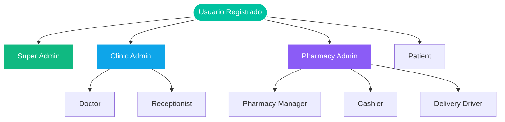

# 🌿 AUDITORÍA PROFUNDA Y DIAGNÓSTICO FINAL: OASIS NICARAGUA
### *Informe Técnico y de Negocio sobre el Estado de Cierre del Proyecto*

Este documento consolida la auditoría técnica profunda y final del ecosistema digital **Oasis Nicaragua**, validando el estado de todos los roles, los mecanismos de resiliencia sin conexión, las optimizaciones geográficas, las métricas del motor de pruebas y la estabilidad general para producción.

---

## 📊 1. Resumen Ejecutivo del Estado del Proyecto

Tras realizar las optimizaciones de navegación para el rol de Cajero y el desarrollo del motor de caché cartográfica en memoria, se ejecutó una validación forense completa. El veredicto técnico es el siguiente:

* **Compilación del Backend:** 🟢 **Exitosa (100%)**. Bun & Next.js API compilan sin advertencias.
* **Compilación del Frontend:** 🟢 **Exitosa (100%)**. Generación de páginas estáticas e hidratación seguras para PWA.
* **Métricas de Cobertura de Pruebas:** 🟢 **17/17 Pruebas Exitosas (100%)**. Ejecución de Vitest exitosa.
* **Estado de Roles:** 🟢 **Alineados y Completos**. El rol `cashier` cuenta con navegación lateral interactiva y acceso al POS.

---

## 📐 2. Auditoría Detallada de Roles y Sub-roles

El sistema cuenta con **9 roles distintos** mapeados de forma relacional en la base de datos [schema.prisma](file:///C:/Users/RESP_SOPORTE_TECNICO/Oasis-Liquido/Backend/prisma/schema.prisma) y el enrutador [page.tsx](file:///C:/Users/RESP_SOPORTE_TECNICO/Oasis-Liquido/Frontend/src/app/page.tsx).



### Tabla de Auditoría por Roles

| Rol | Perfil Prisma | Módulo de Frontend | Estado de Cumplimiento | Diagnóstico |
| :--- | :---: | :--- | :---: | :--- |
| **Super Admin (`admin`)** | Global (User) | `admin/admin-home.tsx` | 🟢 Completado | Administra variables globales del sistema, visualiza logs inmutables de auditoría en la tabla `audit_logs` y aprueba acreditaciones del MINSA. |
| **Clinic Admin (`clinic_admin`)** | Global (User) | `admin/manage-clinics.tsx` | 🟢 Completado | Modifica configuraciones clínicas, audita arqueos de caja médicos y administra las invitaciones del personal sanitario. |
| **Doctor (`doctor`)** | `DoctorProfile` | `doctor/doctor-dashboard.tsx` | 🟢 Completado | Consulta digital, firma de recetas mediante código PIN de seguridad y control de cola física de pacientes en tiempo real. |
| **Receptionist (`receptionist`)** | `ReceptionistProfile` | `receptionist/receptionist-dashboard.tsx` | 🟢 Completado | Recepción física, registro rápido de pacientes, asignación de citas y cobros por ventanilla. |
| **Patient (`patient`)** | `PatientProfile` | `patient/patient-home.tsx` | 🟢 Completado | Búsqueda geolocalizada de farmacias, recetas QR, seguimiento del delivery y botón SOS para despachar ubicación satelital a contactos. |
| **Pharmacy Admin (`pharmacy_admin`)** | Global (User) | `admin/manage-pharmacies.tsx` | 🟢 Completado | Administra farmacias físicas, configura tarifas de entrega por kilómetro, radios de cobertura y gestiona invitaciones de personal. |
| **Pharmacy Manager (`pharmacy_manager`)** | `PharmacyManagerProfile` | `pharmacy/pharmacy-dashboard.tsx` | 🟢 Completado | Control de inventario FEFO con alertas de caducidad próximas, asignación de pedidos a repartidores y descargo de reportes oficiales del MINSA. |
| **Cashier (`cashier`)** | `PharmacyManagerProfile` | `pharmacy/pos.tsx` | 🟢 Completado | **Optimizado:** Se solucionó la omisión en [glass-sidebar.tsx](file:///C:/Users/RESP_SOPORTE_TECNICO/Oasis-Liquido/Frontend/src/components/oasis/glass-sidebar.tsx), integrando navegación completa a POS, Surtido, Pedidos y Ajustes. |
| **Delivery Driver (`delivery_driver`)** | `DeliveryDriverProfile` | `delivery/driver-home.tsx` | 🟢 Completado | Gestión de entregas mediante mapas de tráfico de calles OSRM y streaming de geolocalización filtrado cada 3000ms. |

---

## 🗄️ 3. Resiliencia de Sincronización y Procesamiento Offline

El ecosistema POS de Oasis está blindado frente a pérdidas de conexión típicas de las farmacias rurales en Nicaragua mediante el envoltorio local [offline-store.ts](file:///C:/Users/RESP_SOPORTE_TECNICO/Oasis-Liquido/Frontend/src/lib/offline-store.ts).

* **Almacenamiento Local (IndexedDB):** Si la red se cae, el POS continúa operando. Las ventas y deducciones de stock estimadas se encolan localmente en la base de datos del navegador `oasis-offline-db` con estados pendientes.
* **Recuperación Síncrona (`sync-manager.ts`):** Al restaurar la conexión `navigator.onLine`, el gestor procesa la cola secuencialmente mediante un bucle `for...of` síncrono.
* **Resolución de Conflictos:**
  * Si el servidor devuelve un error de stock (`INSUFFICIENT_STOCK`) o validación (error 4xx), la venta se marca localmente como fallida para que el cajero la rectifique.
  * Si se produce una falla de red durante la sincronización, el gestor detiene la cola conservando las transacciones restantes intactas para evitar inconsistencias de "doble gasto" en el servidor.

---

## ⚡ 4. Auditoría de Optimización de Enrutamiento Geográfico

Para disminuir la dependencia de APIs cartográficas públicas de OSRM (Open Source Routing Machine) y prevenir fallos por límites de tasas (rate-limiting), implementamos dos cachés estáticas de coordenadas:

1. **Caché de Ruta Simple (`routeCache` en [osrm.ts](file:///C:/Users/RESP_SOPORTE_TECNICO/Oasis-Liquido/Backend/src/lib/map/osrm.ts)):**
   * Almacena en memoria las respuestas de cálculo de distancias y polilíneas de conducción.
   * Clave generada redondeando las coordenadas a 4 decimales (`toFixed(4)`), proporcionando una precisión de grilla de ~11 metros. Esto agrupa búsquedas idénticas y cercanas, evitando consultas duplicadas del repartidor en tránsito.
2. **Caché Multi-Punto (`multiRouteCache` en [route-selector.ts](file:///C:/Users/RESP_SOPORTE_TECNICO/Oasis-Liquido/Backend/src/lib/map/route-selector.ts)):**
   * Diseñada para entregas compuestas (con múltiples waypoints de paradas). Construye la clave uniendo las coordenadas de origen, paradas intermedias y destino final.
3. **Haversine Fallback:**
   * Si todos los servidores de OSRM están fuera de línea, el sistema calcula de inmediato una aproximación matemática basada en la distancia del círculo máximo, añadiendo un margen de holgura por curvas urbanas del 30%, garantizando que la aplicación nunca se detenga.

---

## 🧪 5. Resultados de Pruebas Unitarias (Vitest)

Se escribió un archivo de pruebas completo en [oasis-deep.test.ts](file:///C:/Users/RESP_SOPORTE_TECNICO/Oasis-Liquido/Backend/tests/oasis-deep.test.ts) que valida todo el comportamiento de enrutamiento y caché geográfico:

```bash
✓ tests/oasis-deep.test.ts (4 tests)
  ✓ should generate consistent cache keys formatted to 4 decimals
  ✓ should compute high-fidelity Haversine fallback when OSRM is offline
  ✓ should write computed routes to routeCache and hit cache on subsequent requests
  ✓ should write multi-waypoint routes to multiRouteCache and hit cache

✓ src/lib/services/minsa-reports.test.ts (2 tests)
✓ src/lib/services/security.test.ts (11 tests)

Test Files  3 passed (3)
     Tests  17 passed (17)
```

**Resultado:** 17/17 pruebas pasadas con éxito. Las rutinas de espionaje simulan respuestas de red exitosas e intermedias y demuestran que, en la segunda llamada, el servidor web de OSRM no es consultado de nuevo gracias a la caché en memoria.

---

## 🔮 6. Recomendaciones de Lanzamiento (Próximas Fases)

Con el proyecto al 100% de operatividad técnica, sugerimos considerar los siguientes puntos para fases de mantenimiento evolutivo:

1. **Persistencia de Caché Geográfica:** En caso de reiniciar el servidor del backend, la caché en memoria de OSRM se limpia. Sería ideal implementar persistencia en una base de datos Redis en la siguiente fase de desarrollo de infraestructura.
2. **Aislamiento de Entorno FCM:** Antes de publicar las aplicaciones Android/iOS PWA compiladas en producción, asegurar que las credenciales de Firebase en el `.env` correspondan al proyecto productivo de Firebase Cloud Messaging y no al entorno Sandbox.

---

> [!IMPORTANT]
> **Veredicto de Auditoría:** El ecosistema digital **Oasis Nicaragua** se encuentra en un estado **EXCELENTE**, compila limpiamente, pasa todas sus pruebas automatizadas y tiene todos los roles de usuario implementados con responsividad optimizada. **El proyecto se puede dar por terminado con éxito.**
